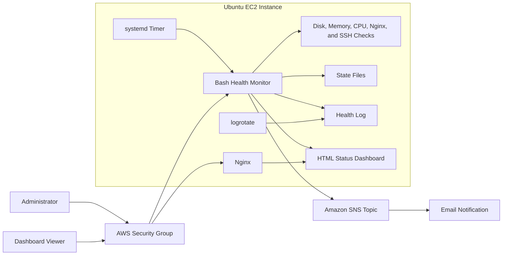

# AWS Linux Server Health Monitoring and Troubleshooting Toolkit

## Overview

This hands-on portfolio project demonstrates how an Ubuntu 24.04 LTS EC2 instance can be monitored with Bash, systemd, Amazon SNS, logrotate, and an Nginx-hosted status dashboard. The toolkit checks disk usage, available memory, normalized CPU load, and the health of the Nginx and SSH services.

The project uses state-transition alerting: it sends one notification when a check changes from `OK` to `WARNING`, remains quiet while the condition persists, and sends a recovery notification when the check returns to `OK`. This reduces repeated notifications and demonstrates a practical response to alert fatigue.

The monitoring was validated through controlled failure simulations involving a stopped service, high memory pressure, high disk usage, and an invalid Nginx configuration. This is a project-based training environment and is not presented as a production deployment.

## Medium Article

Read the complete project walkthrough, implementation details, troubleshooting notes, and lessons learned:

[Building a Linux Server Health Monitoring and Troubleshooting Toolkit](https://medium.com/@rester.mcglown/building-a-linux-server-health-monitoring-and-troubleshooting-toolkit-726d1bb445ff)

## Architecture



## Technologies Used

- AWS CLI, Amazon EC2, IAM instance roles, security groups, and Amazon SNS
- Ubuntu Server 24.04 LTS
- Bash scripting and standard Linux monitoring utilities
- Nginx
- systemd services and timers
- logrotate
- HTML status reporting
- Incident runbooks and controlled failure simulation

## Project Objectives

- Provision an Ubuntu EC2 instance and restrict SSH access to an approved source address.
- Install Nginx as a stateful service that can be monitored and tested.
- Monitor disk usage, available memory, normalized CPU load, and service health.
- Publish alerts through Amazon SNS without storing AWS credentials on the instance.
- Suppress repeated notifications with state-transition alerting.
- Run health checks automatically through a systemd timer.
- Rotate monitoring logs without weakening filesystem permissions.
- Generate an HTML status dashboard from the latest check results.
- Validate monitoring behavior through controlled failure scenarios.
- Document diagnosis and recovery procedures in an incident runbook.

## Repository Contents

```text
.
|-- README.md
|-- configs/
|   |-- logrotate-sys-health
|   |-- sys-health-monitor.conf.example
|   |-- sys-health-monitor.service
|   `-- sys-health-monitor.timer
|-- docs/
|   `-- incident-runbook.md
|-- scripts/
|   |-- install_monitor.sh
|   `-- sys_health_monitor.sh
`-- .gitignore
```

## Monitoring Design

The monitoring script uses Linux's available-memory estimate instead of raw used memory. Linux uses otherwise idle memory for cache, so raw usage can produce misleading alerts. Available memory better represents what the kernel can provide to new workloads.

CPU load is normalized against the number of logical processors reported by `nproc`. A load average of `1.0` has a different meaning on a one-core instance than it does on a multi-core system.

Nginx health requires both an active systemd service and a listening TCP port. This avoids treating a running process as sufficient proof that the web service is available.

## Alerting and IAM

The script can publish alerts to an Amazon SNS topic through the AWS CLI. The EC2 instance should use an IAM role limited to `sns:Publish` on the intended topic. Access keys and secret keys should never be stored in the repository or written to the instance.

Example least-privilege policy:

```json
{
  "Version": "2012-10-17",
  "Statement": [
    {
      "Effect": "Allow",
      "Action": "sns:Publish",
      "Resource": "arn:aws:sns:REGION:ACCOUNT_ID:TOPIC_NAME"
    }
  ]
}
```

Replace the example resource with the real topic ARN when configuring IAM. Do not commit the real account number or topic ARN.

## Installation

Review every file before installing it. From the repository root:

```bash
sudo bash scripts/install_monitor.sh
```

Edit the local configuration:

```bash
sudo nano /etc/sys-health-monitor.conf
```

Set the SNS topic ARN and thresholds appropriate for the environment, then test the service:

```bash
sudo systemctl start sys-health-monitor.service
sudo systemctl status sys-health-monitor.service
sudo systemctl enable --now sys-health-monitor.timer
systemctl list-timers sys-health-monitor.timer
```

The example timer runs every five minutes.

## Status Dashboard

Each monitoring run regenerates an HTML status page at:

```text
/var/www/html/status.html
```

Nginx serves the page using its existing document root. The dashboard is a local operational view, not an authentication boundary. In a production design, access should be restricted through a private network, authenticated proxy, VPN, or another approved control.

## Log Rotation

The included logrotate configuration uses:

```text
su ubuntu syslog
```

This allows rotation to occur with the file's intended user and group context. The configuration should be tested before relying on it:

```bash
sudo logrotate -d /etc/logrotate.d/sys-health-monitor
sudo logrotate -f /etc/logrotate.d/sys-health-monitor
```

## Controlled Failure Validation

| Scenario | Controlled test | Expected result |
|---|---|---|
| Service unavailable | Stop Nginx temporarily | Service and port checks change to `WARNING`; one SNS alert is sent |
| High memory | Run a time-bounded `stress-ng` workload | Available-memory check changes to `WARNING` during the test |
| High disk usage | Create a temporary file without filling the filesystem completely | Disk check changes to `WARNING`; broad file searches help locate the cause |
| Invalid Nginx configuration | Introduce a controlled syntax error and run `nginx -t` | Configuration validation fails even if the old Nginx process remains active |

Failure simulations should only be performed in an isolated lab. Use time limits, preserve backups outside active configuration directories, and remove test artifacts immediately after validation.

## Troubleshooting Highlights

Detailed response procedures are available in [`docs/incident-runbook.md`](docs/incident-runbook.md).

Key lessons included:

- Service status alone does not prove that the expected network port is listening.
- A safely rejected Nginx reload can leave the old process running while the configuration on disk is invalid.
- Monitoring intervals must be considered when designing short-lived failure tests.
- Targeted disk searches should be followed by a broader fallback search.
- logrotate privilege changes may not preserve supplementary group membership.
- State-transition alerting provides useful notifications without repeating the same warning every few minutes.

## Security Considerations

- Restrict SSH to an approved source address or use AWS Systems Manager Session Manager.
- Attach a least-privilege IAM role to the instance instead of storing AWS credentials.
- Limit the IAM policy to `sns:Publish` on one intended topic.
- Do not commit private keys, AWS credentials, account numbers, public addresses, or live resource identifiers.
- Run the monitor as an unprivileged account and grant access only to required files and directories.
- Protect the status dashboard from unrestricted public access.
- Validate Nginx configuration with `sudo nginx -t` before reloading or restarting it.
- Stop or delete test resources after validation to avoid unnecessary charges.

## Known Limitation

The service check confirms process state and port availability, but those checks do not prove that the configuration stored on disk is valid. A production version should add an explicit `nginx -t` check or a deeper HTTP content check so a rejected reload cannot create false confidence.

## Future Improvements

- Add explicit Nginx configuration validation and HTTP content checks.
- Publish custom metrics to Amazon CloudWatch.
- Provision the EC2 instance, IAM role, SNS topic, and security controls with Terraform.
- Replace inbound SSH with AWS Systems Manager Session Manager.
- Add automated script and configuration validation through CI/CD.
- Protect the dashboard with an authenticated access layer.
